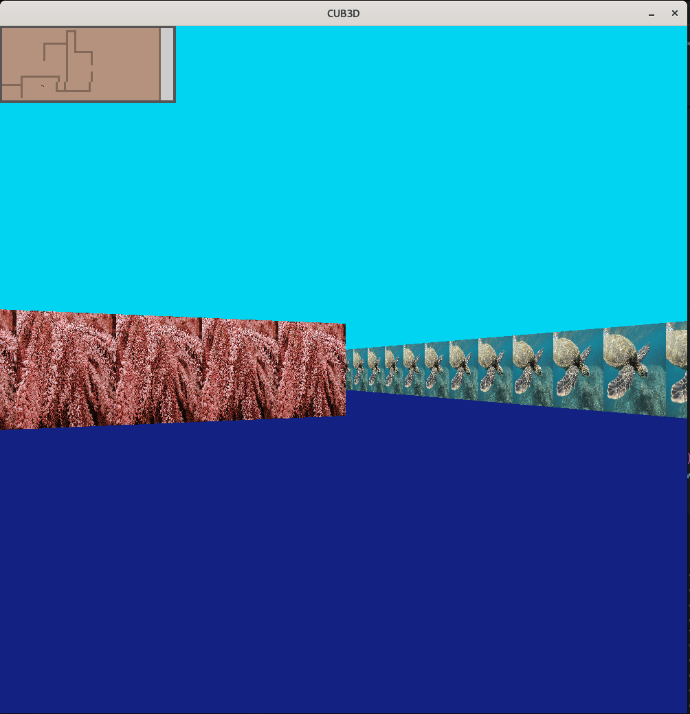
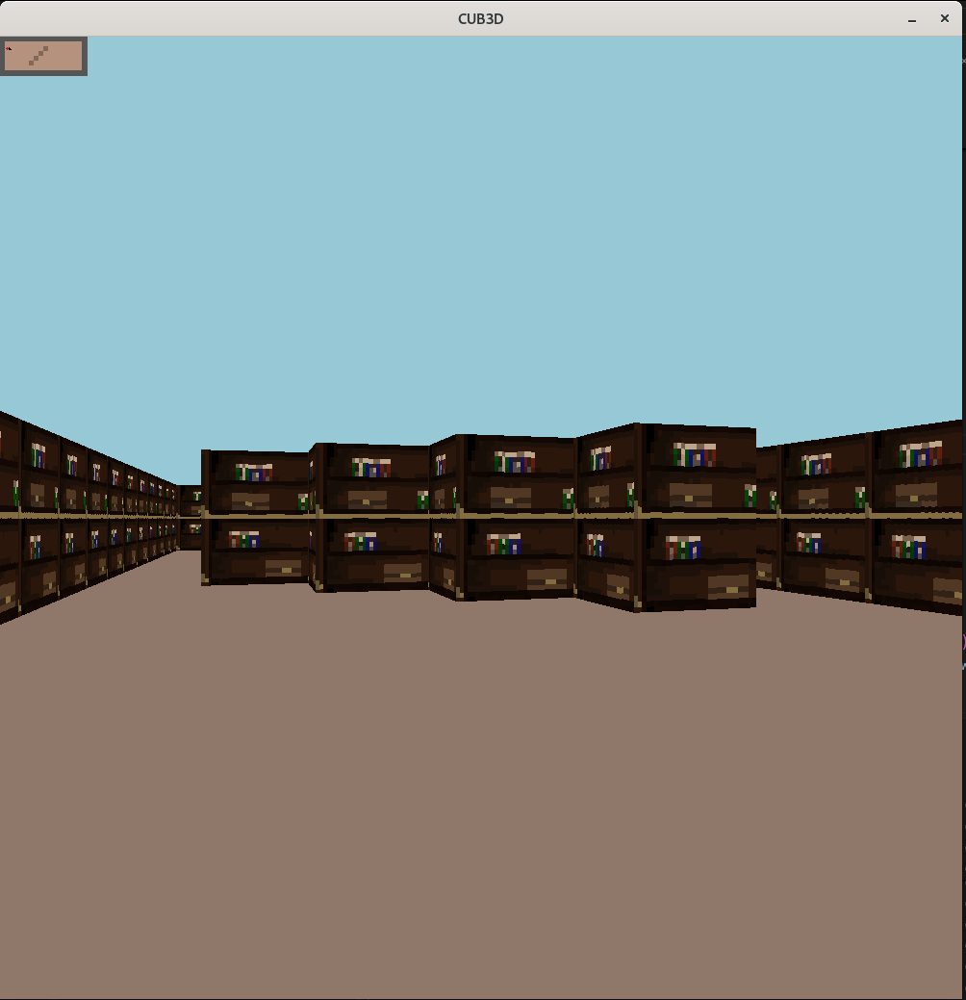

_This project has been created as part of the 42 curriculum by Bertrmar and Cowillem._

# Cub3D &nbsp; [](./LICENSE) [](./minilibx-linux)

## Table of Contents

1. [Description](#description)
2. [Repository Structure](#-repository-structure)
3. [Instructions](#instructions)
	- [Prerequisites](#prerequisites)
	- [Installation](#installation)
	- [Run Project](#run-project)
4. [Author](#author)


## Description
Cub3D is a graphics project at 42 that uses the MiniLibX library (Graphics Library used by 42). This project recreates a 3D experience inspired by classic raycasting games like Doom.

<div class="galerie">
	
	
</div>

## 📁 Repository Structure

The project directory is organized as follows:

```text
cub3D/
.
├── image
├── include
├── libft
├── Makefile
├── map
├── minilibx-linux
├── README.md
└── src
    ├── drawing
    ├── keyboard
    ├── main.c
    ├── mini_map
    └── parsing
```

## Instructions

### Prerequisites

- Linux / MacOS distribution (POSIX-compliant systems).
- C compiler (cc or gcc)
- Make

### Installation

**Clone the repository:**
```bash
git clone https://github.com/bertima/cub3d cub3D
cd cub3D
```
You are now in the project titled cub3D.

### Run Project

1. <u>Makefile</u>   
	
	This project relies on a Makefile located at the root of the repository.  
	Main command is: 

	```bash
	make && ./cub3D map/book.cub
	```
	You have more feature in the Makefile:  
	`make` : Compiles your project and create the `./cub3D` executable.  
	`make clean` : Removes object files (.o) from `libft`, `minilibx` and the project.  
	`make fclean` : Uses the clean rule and removes the executable.  
	`make re` : Full recompilation.  
2. <u>Map</u>

	Now you have an executable titled ./cub3D, choose a map in `map` folder.  
	If you want to create your map, create new file in `map` folder with a .cub extension.  
	Use the template below and fill the field with your configuration:
	```bash
	NO image/<your_image>.xpm # North wall
	EA image/<your_image>.xpm # East wall
	SO image/<your_image>.xpm # South wall
	WE image/<your_image>.xpm # West wall

	F ???,???,??? # Floor Fill with numbers inside 0->255
	C ???,???,??? # Ceiling Fill with numbers inside 0->255

	111111111111111111111111111111 # 1 for wall and 0 for floor N, E, W, S for player
	111111000111111111111000111111
	111110000011111111110000011111
	1111000N0001111111100000001111
	111000000000111111000000000111
	110000000000011110000000000011
	100001111100000000001111100001
	110000111000011110000111000011
	111000010000111111000010000111
	111100000001111111100000001111
	111110000011111111110000011111
	111111000111111111111000111111
	111111101111111111111101111111
	111111101111111111111101111111
	111111000111111111111000111111
	111110000011111111110000011111
	111100000001111111100000001111
	111000000000111111000000000111
	110000000000011110000000000011
	100001111100000000001111100001
	110000111000011110000111000011
	111000010000111111000010000111
	111100000001111111100000001111
	111110000011111111110000011111
	111111000111111111111000111111
	111111111111111111111111111111
	```

## Author

- **Bertrand Martin** ([github](https://github.com/bertima))
- **Colin Willems** ([github](https://github.com/colinwlms))